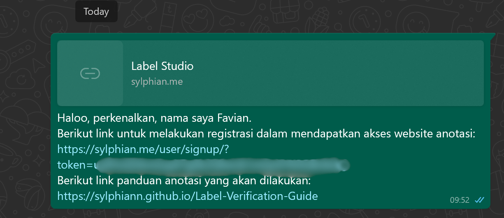
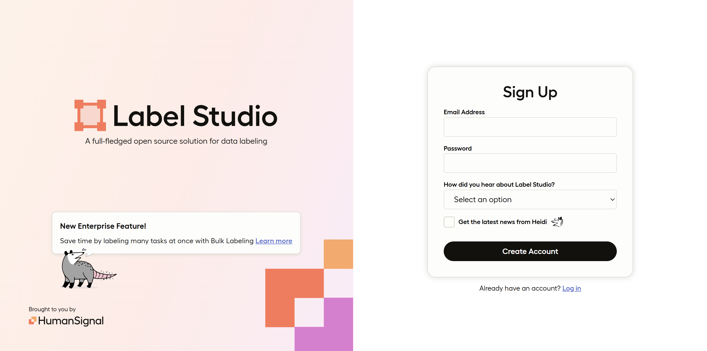
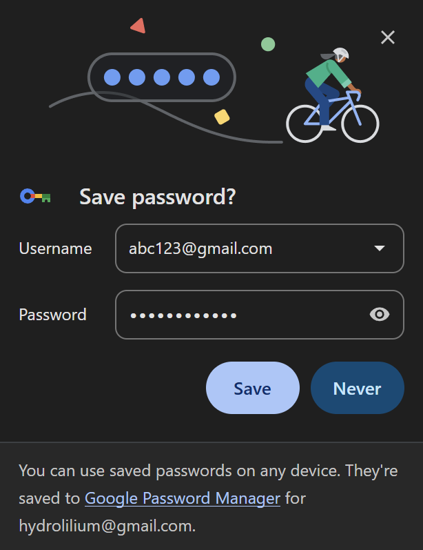
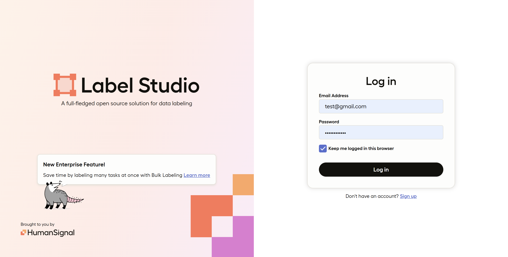
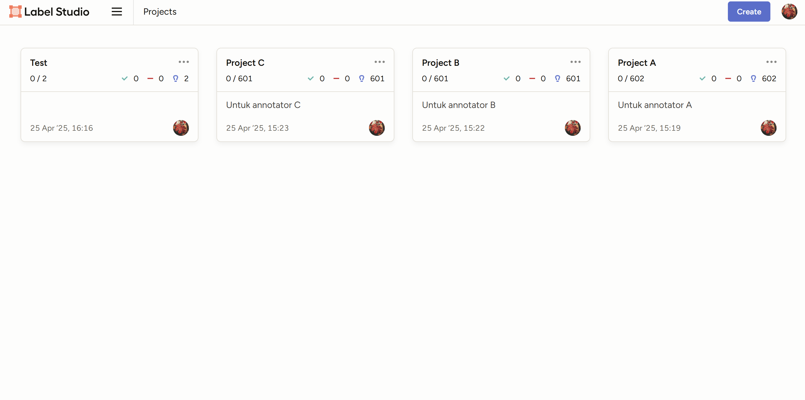
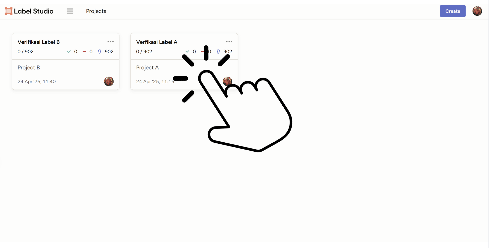
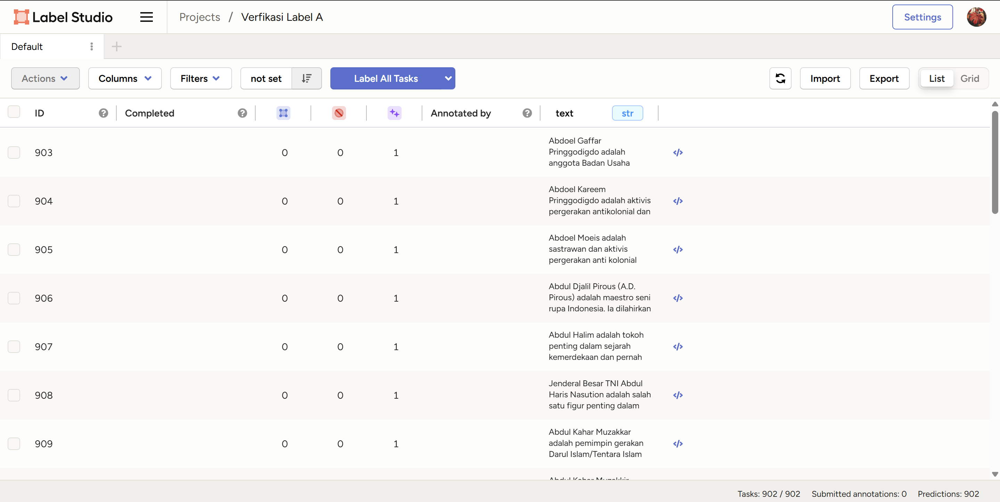
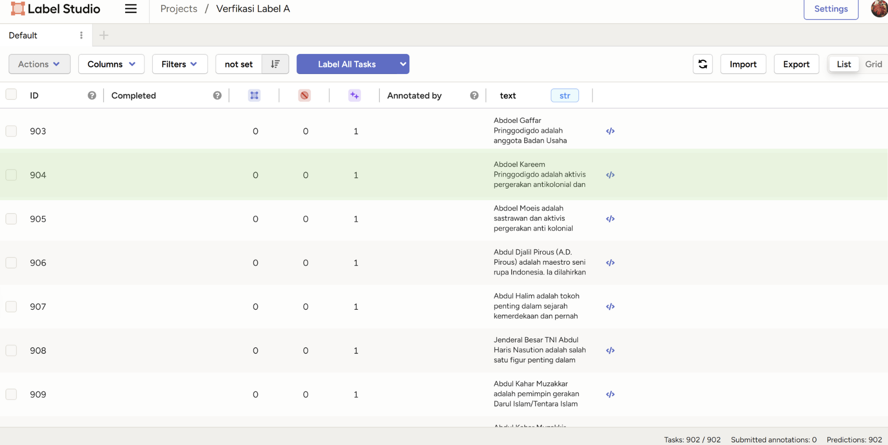
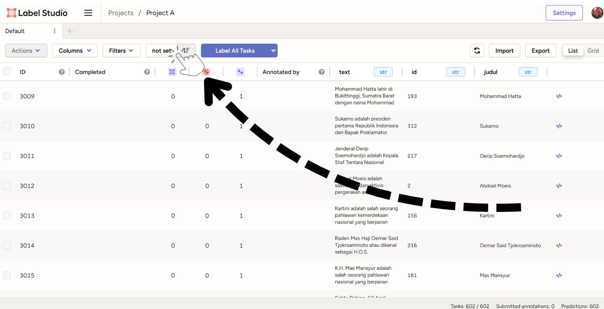
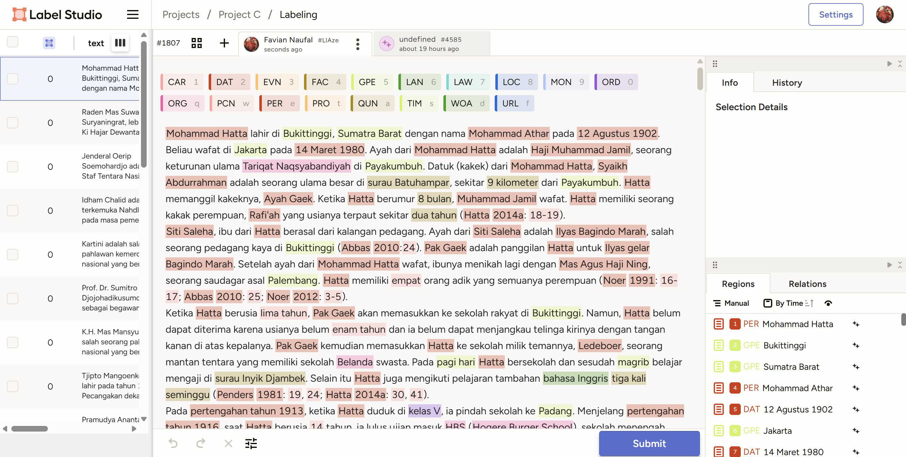

# Instruksi

### 1. Mengakses aplikasi label-studio  

Proses validasi label akan dilakukan pada halaman web `sylphian.me` dengan *link* akses berikut ini: [https://sylphian.me/](https://sylphian.me/)  

Dalam mengakses/*autentikasi* halaman web untuk pertama kalinya, anotator perlu mengakses *link* registrasi yang hanya akan diberikan kepada anotator yang dituju. Jika anda seorang anotator yang belum mendapatkan akses *link* tersebut, silahkan [hubungi developer](#kontak-developer) untuk panduan lebih lanjut.

Contoh: pesan akses registrasi aplikasi anotator melalui WhatsApp

### 2. Melakukan *registrasi* pada aplikasi label-studio  

Ketika anda berhasil mendapatkan pesan yang berisikan link registrasi, anda akan ditujukan terhadap halaman registrasi dari web anotasi ketika mengakses link registrasi tersebut.

Halaman registrasi web

Untuk melakukan registrasi atau *sign-up*, anda perlu mengisi masukkan `Email Address` dan `Password` yang akan anda gunakan ketika anda akan melakukan *login*, untuk mengakses web anotasi kembali kedepannya. Selanjutnya, anda dapat menekan tombol `Create Account` untuk menyelesaikan tahap registrasi.  

**Opsional**: Anda dapat menyimpan `Email Address` dan `Password` anda melalui browser anda masing-masing, untuk memudahkan akses *login* kedepannya.

    
    
Menyimpan kredensial autentikasi

### 3. Melakukan *login* pada aplikasi label-studio  

Ketika anda berhasil sudah pernah melakukan registrasi terhadap web anotasi sebelumnya, anda dapat mengakses web anotasi kembali dengan melakukan *login* dengan memasukkan kredensial-kredensial (`Email Address` dan `Password`) yang anda gunakan pada progres registrasi sebelumnya.

Halaman login web

### 4. Mengakses *Dashboard* utama label-studio

Ketika anda telah berhasil melakukan autentikasi ke dalam web anotasi `sylphian.me`, anda akan memasuki halaman `Dashboard` utama. Pada halaman ini, anda akan diperlihatkan project-project yang dapat anda akses, beberapa diantaranya adalah `Project A`, `Project B`, dan `Project C`.

Halaman dashboard, dengan project A dan project B di dalamnya

Masing-masing dari kedua project tersebut memiliki `~601` dokumen untuk anda (anotator) anotasikan, dengan total dokumen yang akan dinotasi adalah `1804`.  

### 5. Mengakses salah-satu Project dalam label-studio

Anda dapat membuka project yang dituju, dengan menekan area project yang berkaitan.

Mengakses Project A

Ketika anda telah mengakses salah satu project yang dipilih melalui dashboard, maka anda akan memasukki halaman project yang diinginkan.

Halaman Project A

### 6. Navigasi Project dalam label-studio

Pada halaman project, anda akan diperlihatkan kumpulan **dokumen**-**dokumen** yang anda akan anotasi. Berikut adalah detail dari list dokumen yang perlu anda perhatikan:

Detail-detail dalam sebuah project

- Kotak **<code>BIRU</code>** merupakan atribut utama yang mendefiniskan sebuah entry, sepert:
    - **text** Merupakan isi tulisan yang berada di dalam dokumen tersebut, untuk di anotasikan.  
    - **id** adalah nomor unik dari yang berperan sebagai nomor identitas dari setiap dokumennya.
    - **judul** adalah judul dari dokumen tersebut.
- Kotak **<code>MERAH</code>** merupakan *list* atau kumpulan dokumen yang perlu anda notasikan.
    
- Kotak **<code>HIJAU</code>** merupakan atribut status anotasi yang ada pada masing-masing dokumen, seperti:
    - **Completed** merupakan status yang menandakan apakah dokumen tersebut **sudah** selesai dianotasikan. Jika kolom tersebut masih kosong untuk suatu dokumen, artinya dokumen tersebut belum selesai dianotasi.
    - **Annotated by** merupakan penanda siapakah yang telah menyelesaikan anotasi pada dokumen tersebut. Jika kolom tersebut masih kosong untuk suatu dokumen, artinya dokumen tersebut juga belum selesai dianotasi.
    - Klik [tautan berikut]() untuk melihat cara menyelesaikan proses anotasi.

Melakukan sorting terhadap dokumen

Anda juga dapat melakukan *sorting* terhadap dokumen yang ingin anda anotasikan. Salah satu hal yang paling berguna untuk fitur ini adalah melakukan *sorting* terhadap dokumen-dokumen yang belum anda anotasikan untuk *berada di paling atas*, dengan memasukkan atribut `Completed` pada tahap *sorting*.

### 7. Mengakses dokumen anotasi dalam Project label-studio

Anda dapat membuka dokumen yang dituju untuk melakukan **anotasi** pada dokumen tersebut, dengan menekan area dokumen yang berkaitan, seperti yang diperlihatkan pada gambar berikut ini.

Melakukan sorting terhadap dokumen

Setelah anda melakukan tahap tersebut, anda akan ditujukan kepada halaman anotasi pada dokumen tersebut, seperti yang diperlihatkan pada gambar berikut ini.

Halaman anotasi dokumen

# Kontak Developer

Jika terdapat kendala, atau ada yang perlu ditanyakan lebih lanjut, silahkan hubungi *developer* melalui salah satu dari kontak-kontak berikut ini:  

- **WhatsApp**: `+6281259281333`
- **Discord**: `sylphian`
- **Line**: `faviann_`