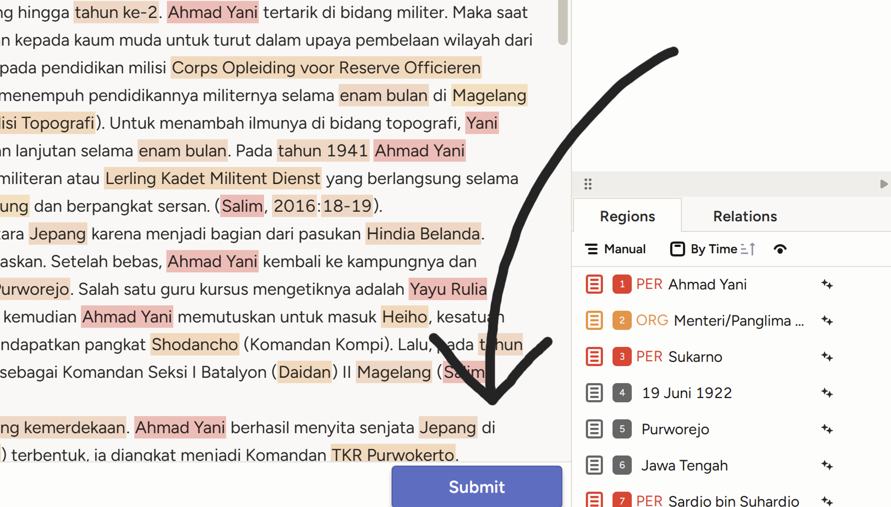

# Panduan Verifikasi Label

TODO: List of Content

## Instruksi Verifikasi Label

Lorem ipsum

## Petunjuk penggunaan Label-Studio

1. ### Memberikan label kepada sebuah entitas

<iframe 
  width="560" 
  height="315" 
  src="https://www.youtube.com/embed/zTNfcWTmmqk?modestbranding=1&rel=0" 
  frameborder="0" 
  allowfullscreen>
</iframe>

2. ### Menghapus label dari sebuah entitas

<iframe 
  width="560" 
  height="315" 
  src="https://www.youtube.com/embed/HMYS0lkvB74?modestbranding=1&rel=0" 
  frameborder="0" 
  allowfullscreen>
</iframe>

3. ### Mengganti label sebuah entitas

<iframe 
  width="560" 
  height="315" 
  src="https://www.youtube.com/embed/-zOutDnQA-I?modestbranding=1&rel=0" 
  frameborder="0" 
  allowfullscreen>
</iframe>

4. ### Menyelesaikan hasil verifikasi sebuah dokumen

Ketika seluruh label dalam dokumen telah diverifikasi kebenarannya. Klik tombol `Submit` berikut yang berada di bagian bawah layar.  

## Petunjuk Label yang digunakan

Berikut adalah label-label yang digunakan untuk diverifikasi:

### Daftar Label

| Label           | Nama Label                       | Penjelasan Singkat                                                     |
|:---------------:|:-------------------------------- |:---------------------------------------------------------------------- |
| [**CAR**](#car) | Cardinal                         | Nomor kardinal                                                         |
| [**DAT**](#dat) | Date                             | Tanggal                                                                |
| [**EVN**](#evn) | Event                            | *Event* atau sebuah peristiwa                                          |
| [**FAC**](#fac) | Facility                         | Fasilitas-fasilitas yang dapat berupa gedung atau bangunan             |
| [**GPE**](#gpe) | Geopolitical Entity              | Wilayah yang diatur secara politik, termasuk desa, kota, hingga negara |
| [**LAN**](#lan) | Language                         | Nama bahasa                                                            |
| [**LAW**](#law) | Law                              | Nama hukum                                                             |
| [**LOC**](#loc) | Location                         | Lokasi secara general                                                  |
| [**MON**](#mon) | Money                            | Jumlah dan nama mata uang                                              |
| [**ORD**](#ord) | Ordinal                          | Nomor ordinal                                                          |
| [**ORG**](#org) | Organization                     | Nama perkumpulan atau organisasi                                       |
| [**PCN**](#pcn) | Percentage                       | Nilai Persen                                                           |
| [**PER**](#per) | Person                           | Nama seseorang                                                         |
| [**PRO**](#pro) | product                          | Nama sebuah produk                                                     |
| [**TIM**](#tim) | Time                             | Waktu                                                                  |
| [**WOA**](#woa) | Work or Art                      | Nama sebuah karya seni                                                 |
| [**URL**](#url) | *Uniform Resource Locator* (URL) | Alamat sebuah *web*                                                    |

### Definisi dan Contoh Masing-Masing Label

1. #### CAR
   
   Entitas angka yang menggambarkan jumlah sesuatu. Pada proses verifikasi label ini, entitas berupa jumlah halaman yang ditunjukkan dalam sitasi, juga dimasukkan sebagai anggota label ini. 
   
   Contoh:
   
   - Tadi pagi, saya memakan 5 apel dan dua pisang.
   
   - Pertengahan 1949, ia diminta Wakil Presiden RI, Hatta, untuk turut menjemput tokoh-tokoh PDRI di Sumatera Tengah (Chaniago, 1981: 87-95, 119)
   
   Menjadi:
   
   - Tadi pagi, saya memakan [**CAR 5**] apel dan [**CAR dua**] pisang.
   
   - Pertengahan 1949, ia diminta Wakil Presiden RI, Hatta, untuk turut menjemput tokoh-tokoh PDRI di Sumatera Tengah (Chaniago, 1981: [**CAR 87-95**], [**CAR 119**])

2. #### DAT
   
   Entitas yang menjujukkan sebuah tanggal.
   
   Contoh:
   
   - Ia lahir pada 13 Agustus 1871 di Palembayan, Agam, Sumatra Barat, dan meninggal pada 16 Oktober 1937 di GPE Bandung.
   
   Menjadi:
   
   - Ia lahir pada [**DAT 13 Agustus 1871**] di Palembayan, Agam, Sumatra Barat, dan meninggal pada [**DAT 16 Oktober 1937**] di Bandung.

3. #### EVN
   
   Entitas yang menjujukkan sebuah kejadian atau peristiwa.
   
   Contoh:
   
   - Kemudian, pada [EVN Kongres Sarekat Islam kedua] yang dilaksanakan di [GPE Jakarta] pada [DAT 1917], [PER Abdul Moeis] mengusulkan agar [ORG Sarekat Islam] bergabung dengan [ORG Volksraad]. Adapun alasan [PER Abdul Moeis] mengajukan usulan ini karena, menurutnya jika [ORG SI] bergabung dengan [ORG Volksraad]
   
   Menjadi:
   
   - Kemudian, pada [EVN Kongres Sarekat Islam kedua] yang dilaksanakan di [GPE Jakarta] pada [DAT 1917], [PER Abdul Moeis] mengusulkan agar [ORG Sarekat Islam] bergabung dengan [ORG Volksraad]. Adapun alasan [PER Abdul Moeis] mengajukan usulan ini karena, menurutnya jika [ORG SI] bergabung dengan [ORG Volksraad]

4. #### FAC
   
   Entitas bangunan atau fasilitas buatan manusia, seperti "Bandara Soekarno-Hatta" atau "Jembatan Suramadu".​
   
   Contoh:
   
   - Saleh bersama dengan Komodor Udara Agustinus Adisutjipto dan Opsir Muda Udara Adisoemarmo Wirjokusumo gugur dalam peristiwa penembakan jatuh pesawat angkut C-47 Dakota VT-CLA di atas Pangkalan Udara Maguwo, Yogyakarta (kini Lanud Adisucipto) (Subdirsejarah: 140-44)
   
   Menjadi:
   
   - Saleh bersama dengan Komodor Udara Agustinus Adisutjipto dan Opsir Muda Udara Adisoemarmo Wirjokusumo gugur dalam peristiwa penembakan jatuh pesawat angkut C-47 Dakota VT-CLA di atas [**FAC Pangkalan Udara Maguwo**], Yogyakarta (kini [**FAC Lanud Adisucipto**]) (Subdirsejarah: 140-44)

5. #### GPE
   
   Entitas wilayah yang memiliki pemerintahan, seperti desa, kota, atau negara.
   
   Pada contoh yang sama:
   
   - Ia lahir pada 13 Agustus 1871 di Palembayan, Agam, Sumatra Barat, dan meninggal pada 16 Oktober 1937 di GPE Bandung.
   
   Menjadi:
   
   - Ia lahir pada 13 Agustus 1871 di [**GPE Palembayan**], [**GPE Agam**], [**GPE Sumatra Barat**], dan meninggal pada 16 Oktober 1937 di [**GPE Bandung**]

6. #### LAN
   
   Entitas yang berupa nama bahasa, seperti "Bahasa Indonesia" atau "Bahasa Inggris".
   
   Contoh:
   
   - Inggit berperan sebagai pendamping yang loyal, sekaligus menjadi penerjemah jika masyarakat setempat hanya memahami bahasa Sunda.
   
   Menjadi:
   
   - Inggit berperan sebagai pendamping yang loyal, sekaligus menjadi penerjemah jika masyarakat setempat hanya memahami [**LAN bahasa Sunda**].

7. #### LAW
   
   Entitas yang berupa nama peraturan atau undang-undang, seperti "UU ITE".
   
   Contoh:
   
   - Palar dianugerahi gelar Pahlawan Nasional bertepatan dengan Hari Pahlawan pada tanggal 10 November 2013 oleh Presiden Susilo Bambang Yudhoyono berdasarkan Keppres No. 68/TK/Tahun 2013 tanggal 06 November 2013.
   
   Menjadi:
   
   - Palar dianugerahi gelar Pahlawan Nasional bertepatan dengan Hari Pahlawan pada tanggal 10 November 2013 oleh Presiden Susilo Bambang Yudhoyono berdasarkan [**LAW Keppres No. 68/TK/Tahun 2013**] tanggal 06 November 2013.

8. #### LOC
   
   Entitas tempat atau lokasi geografis yang tidak memiliki pemerintahan, seperti "Gunung Everest" atau "Laut Jawa".
   
   Contoh:
   
   - Namun, Tirto akhirnya dihukum dengan dibuang ke Teluk Betung Lampung yang berhasil menggugat kembali Tirto pada masa Gubernur Jenderal Idenburg, pengganti Van Heutsz (Toer, 2003: 73; Dahlan, 2007: 5).
   
   Menjadi:
   
   - Namun, Tirto akhirnya dihukum dengan dibuang ke [**LOC Teluk Betung Lampung**] yang berhasil menggugat kembali Tirto pada masa Gubernur Jenderal Idenburg, pengganti Van Heutsz (Toer, 2003: 73; Dahlan, 2007: 5).

9. #### MON
   
   Entitas yang dapat berupa jumlah uang serta nama mata uang yang digunakan, seperti "Rp100.000" atau "5 dolar".
   
   Contoh:
   
   - Sebagai murid yang diterima, mereka berhak mendapat tunjangan 70 gulden dan pakaian seragam lengkap dengan koppel riemnya.
   
   Menjadi:
   
   - Sebagai murid yang diterima, mereka berhak mendapat tunjangan [**MON 70 gulden**] dan pakaian seragam lengkap dengan koppel riemnya.

10. #### ORD
    
    Entitas angka yang menunjukkan urutan, seperti "pertama" atau "ke-3".
    
    Contoh:
    
    - Ia adalah sebagai putera ke-7 dari Mas Sastrowardojo dan Roepeni.
    - Pada 1921, Hatta lulus dari Sekolah Dagang PHS dan meraih peringkat tiga terbaik.
    
    Menjadi:
    
    - Ia adalah sebagai putera [**ORD ke-7**] dari Mas Sastrowardojo dan Roepeni.
    - Pada 1921, Hatta lulus dari Sekolah Dagang PHS dan meraih peringkat [**ORD tiga**] terbaik.

11. #### ORG
    
    Entitas organisasi atau lembaga, seperti "PBB" atau "Universitas Indonesia".
    
    Contoh:
    
    - Kemudian, pada Kongres Sarekat Islam kedua yang dilaksanakan di Jakarta pada 1917, Abdul Moeis mengusulkan agar Sarekat Islam bergabung dengan Volksraad. Adapun alasan Abdul Moeis mengajukan usulan ini karena, menurutnya jika SI bergabung dengan Volksraad.
    
    Menjadi:
    
    - Kemudian, pada Kongres Sarekat Islam kedua yang dilaksanakan di Jakarta pada 1917, Abdul Moeis mengusulkan agar [**ORG Sarekat Islam**] bergabung dengan [**ORG Volksraad**]. Adapun alasan Abdul Moeis mengajukan usulan ini karena, menurutnya jika [**ORG SI**] bergabung dengan [**ORG Volksraad**].

12. #### PCN
    
    Entitas persentase, seperti "20%" atau "setengah persen".​
    
    Contoh:
    
    - Ketika kekuasaan Ibnu Sutowo akan berakhir, produksi minyak tumbuh sekitar 15% ( 1968-1969) dan hampir 20% pada tahun 1970 ( Ricklefs, 2008: 612-613)
    
    Menjadi:
    
    - Ketika kekuasaan Ibnu Sutowo akan berakhir, produksi minyak tumbuh sekitar [**PCN 15%**] (1968-1969) dan hampir [**PCN 20%**] pada tahun 1970  (Ricklefs, 2008: 612-613)

13. #### PER
    
    Entitas yang menjujukkan nama atau julukan seseorang. Dalam kasus ini, *prefix* dan *suffix* yang dapat berupa pangkat (`Kolonel-` atau `Presiden-`) atau *title* (`Dr.-` atau `- S.Kom.`) seseorang, juga termasuk sebagai satu entitas.
    
    Contoh:
    
    - Saleh bersama dengan Komodor Udara Agustinus Adisutjipto dan Opsir Muda Udara Adisoemarmo Wirjokusumo gugur dalam peristiwa penembakan jatuh pesawat angkut C-47 Dakota VT-CLA di atas Pangkalan Udara Maguwo, Yogyakarta (kini Lanud Adisucipto) (Subdirsejarah: 140-44)
    
    Menjadi:
    
    - [**PER Saleh**] bersama dengan [**PER Komodor Udara Agustinus Adisutjipto**] dan [**PER Opsir Muda Udara Adisoemarmo Wirjokusumo**] gugur dalam peristiwa penembakan jatuh pesawat angkut C-47 Dakota VT-CLA di atas Pangkalan Udara Maguwo, Yogyakarta (kini Lanud Adisucipto) (Subdirsejarah: CAR 140-44)

14. #### PRO
    
    Entitas yang dapat berupa nama sebuah produk atau barang. Jenis atau tipe produk tidak dimasukkan sebagai entitas, menyisakan namanya saja.
    
    Contoh:
    
    - Saleh bersama dengan Komodor Udara Agustinus Adisutjipto dan Opsir Muda Udara Adisoemarmo Wirjokusumo gugur dalam peristiwa penembakan jatuh pesawat angkut C-47 Dakota VT-CLA di atas Pangkalan Udara Maguwo, Yogyakarta (kini Lanud Adisucipto) (Subdirsejarah: 140-44)
    
    Menjadi:
    
    - Saleh bersama dengan Komodor Udara Agustinus Adisutjipto dan Opsir Muda Udara Adisoemarmo Wirjokusumo gugur dalam peristiwa penembakan jatuh pesawat angkut [**PRO C-47 Dakota VT-CLA**] di atas Pangkalan Udara Maguwo, Yogyakarta (kini Lanud Adisucipto) (Subdirsejarah: 140-44)

15. #### TIM
    
    Entitas waktu spesifik dalam sehari, seperti "pukul 10 pagi" atau "jam 3 sore".
    
    Contoh:
    
    - Naskah proklamasi itu kemudian dikumandangkan di rumah Sukarno pada pagi harinya, bersamaan dengan pengibaran bendera sang saka merah putih jahitan Fatmawati.
    - Pada akhirnya Gurnam Singh mampu mengungguli saingan terberatnya kala itu, yakni Liem San Lee, dengan torehan waktu 36 menit 9 detik (Indische Courant voor Nederland, 17 November 1954)
    
    Menjadi:
    
    - Naskah proklamasi itu kemudian dikumandangkan di rumah Sukarno pada [**TIM pagi harinya**], bersamaan dengan pengibaran bendera sang saka merah putih jahitan Fatmawati.
    - Pada akhirnya Gurnam Singh mampu mengungguli saingan terberatnya kala itu, yakni Liem San Lee, dengan torehan waktu [**TIM 36 menit 9 detik**] ( Indische Courant voor Nederland, 17 November 1954)

16. #### WOA
    
    Entitas karya seni atau sastra, seperti "Laskar Pelangi" atau "Monalisa". Dalam kasus tertentu, nama majalah yang menjadi sitasi juga diikutsertakan dalam label ini.
    
    - Pada akhirnya Gurnam Singh mampu mengungguli saingan terberatnya kala itu, yakni Liem San Lee, dengan torehan waktu 36 menit 9 detik (WOA Indische Courant voor Nederland, 17 November 1954).
    - Semenjak kecil, ia berkenalan dengan syair-syair dan tulisan dalam dunia sastra Melayu tradisional, di antaranya adalah Hikayat Hang Tuah, Hikayat Panca Tanderan, hingga Sejarah Melayu (Ridho, 2019: 66; Dumadi, 1993: 57).
    
    Menjadi:
    
    - Pada akhirnya Gurnam Singh mampu mengungguli saingan terberatnya kala itu, yakni Liem San Lee, dengan torehan waktu 36 menit 9 detik ([**WOA Indische Courant voor Nederland**], 17 November 1954).
    - Semenjak kecil, ia berkenalan dengan syair-syair dan tulisan dalam dunia sastra Melayu tradisional, di antaranya adalah [**WOA Hikayat Hang Tuah**], [**WOA Hikayat Panca Tanderan**], hingga [**WOA Sejarah Melayu**] (Ridho, 2019: 66; Dumadi, 1993: 57).

17. #### URL
    
    Entitas yang berupa Alamat sebuah *web*.
    
    Contoh:
    
    - Sultan Hamid II wafat di Jakarta pada 30 Maret 1978 ketika sedang menjalankan Sholat Maghrib. Jenazahnya dimakamkan di pemakaman keluarga Kesultanan Pontianak di Batulayang ( https://historia.id/politik/articles/lima-fakta-tentang-sultan-hamid-ii-vXl3X/page/3 ).
    
    Menjadi:
    
    - Sultan Hamid II wafat di Jakarta pada 30 Maret 1978 ketika sedang menjalankan Sholat Maghrib. Jenazahnya dimakamkan di pemakaman keluarga Kesultanan Pontianak di Batulayang ( [**URL** https://historia.id/politik/articles/lima-fakta-tentang-sultan-hamid-ii-vXl3X/page/3 **]**).
