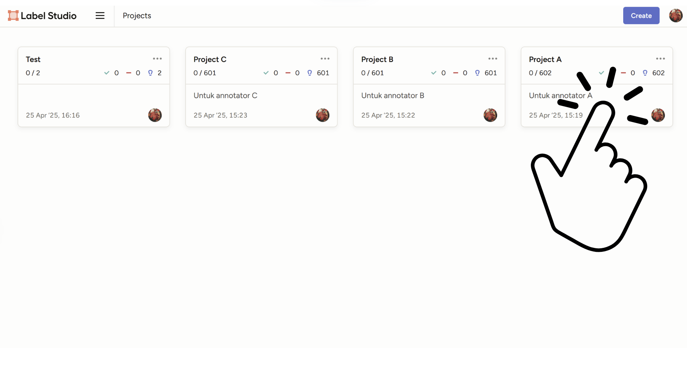
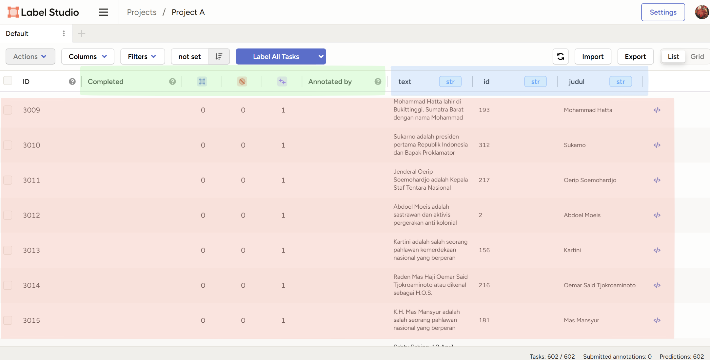
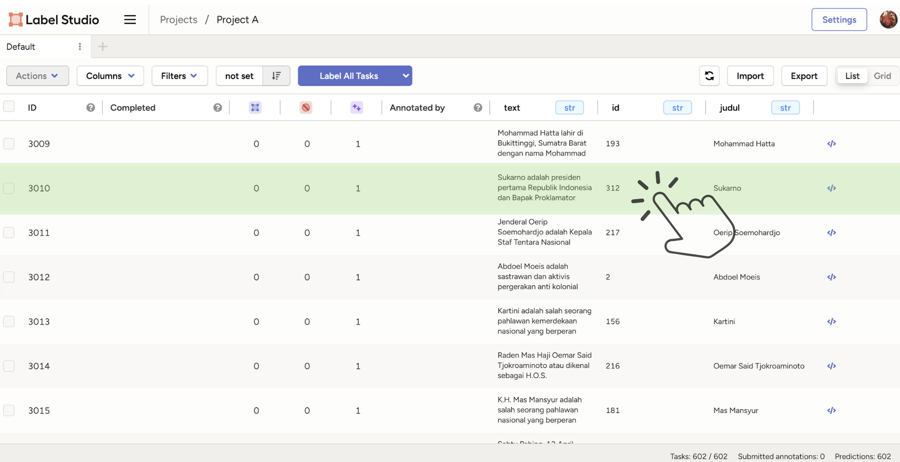

## Navigasi panduan

- [Instruksi Validasi Label](#instruksi-validasi-label)
    - [Mengakses aplikasi label-studio](#1-mengakses-aplikasi-label-studio)
    - [Melakukan *registrasi* pada aplikasi label-studio](#2)
    - [Melakukan *login* pada aplikasi label-studio](#3-melakukan-login-pada-aplikasi-label-studio)
    - [Mengakses *Dashboard* utama label-studio](#4-mengakses-dashboard-utama-label-studio)
    - [Mengakses salah-satu Project dalam label-studio](#5-mengakses-salah-satu-project-dalam-label-studio)
    - [Navigasi Project dalam label-studio](#6-navigasi-project-dalam-label-studio)
    - [Mengakses dokumen anotasi dalam Project label-studio](#7-mengakses-dokumen-anotasi-dalam-project-label-studio)
    - [Navigasi anotasi dokumen dalam label-studio](#8-navigasi-anotasi-dokumen-dalam-label-studio)
    - [Panduan proses validasi label](#9-panduan-proses-validasi-label)
        - [Menambahkan sebuah label](#menambahkan-sebuah-label)
        - [Menghapus sebuah label](#menghapus-sebuah-label)
        - [Mengganti label pada sebuah entitas](#mengganti-sebuah-label)
        - [Menyelesaikan validasi label sebuah dokumen](#menyelesaikan-validasi-label-sebuah-dokumen)
- [Petunjuk Label yang digunakan](#petunjuk-label-yang-digunakan)
    - [Definisi dan Contoh Masing-Masing Label](#definisi-dan-contoh-masing-masing-label)
- [Kontak Developer](#kontak-developer)

## Instruksi Validasi Label

### 1. Mengakses aplikasi label-studio  

Proses validasi label akan dilakukan pada halaman web `sylphian.me` dengan *link* akses berikut ini: [https://sylphian.me/](https://sylphian.me/)  

Dalam mengakses/*autentikasi* halaman web untuk pertama kalinya, anotator perlu mengakses *link* registrasi yang hanya akan diberikan kepada anotator yang dituju. Jika anda seorang anotator yang belum mendapatkan akses *link* tersebut, silahkan [hubungi developer](#kontak-developer) untuk panduan lebih lanjut.


<div style="text-align: center;">Contoh: pesan akses registrasi aplikasi anotator melalui WhatsApp</div>

### 2. Melakukan *registrasi* pada aplikasi label-studio  

Ketika anda berhasil mendapatkan pesan yang berisikan link registrasi, anda akan ditujukan terhadap halaman registrasi dari web anotasi ketika mengakses link registrasi tersebut.


<div style="text-align: center;">Halaman registrasi web</div>

Untuk melakukan registrasi atau *sign-up*, anda perlu mengisi masukkan `Email Address` dan `Password` yang akan anda gunakan ketika anda akan melakukan *login*, untuk mengakses web anotasi kembali kedepannya. Selanjutnya, anda dapat menekan tombol `Create Account` untuk menyelesaikan tahap registrasi.  

**Opsional**: Anda dapat menyimpan `Email Address` dan `Password` anda melalui browser anda masing-masing, untuk memudahkan akses *login* kedepannya.
<div style="text-align: center; padding: 0px;">
    
    <p>Menyimpan kredensial autentikasi</p>
</div>

### 3. Melakukan *login* pada aplikasi label-studio  

Ketika anda berhasil sudah pernah melakukan registrasi terhadap web anotasi sebelumnya, anda dapat mengakses web anotasi kembali dengan melakukan *login* dengan memasukkan kredensial-kredensial (`Email Address` dan `Password`) yang anda gunakan pada progres registrasi sebelumnya.


<div style="text-align: center;">Halaman login web</div>

### 4. Mengakses *Dashboard* utama label-studio

Ketika anda telah berhasil melakukan autentikasi ke dalam web anotasi `sylphian.me`, anda akan memasuki halaman `Dashboard` utama. Pada halaman ini, anda akan diperlihatkan project-project yang dapat anda akses, beberapa diantaranya adalah `Project A`, `Project B`, dan `Project C`.


<div style="text-align: center;">Halaman dashboard, dengan project A dan project B di dalamnya</div>

Masing-masing dari kedua project tersebut memiliki `~601` dokumen untuk anda (anotator) anotasikan, dengan total dokumen yang akan dinotasi adalah `1804`.  

### 5. Mengakses salah-satu Project dalam label-studio

Anda dapat membuka project yang dituju, dengan menekan area project yang berkaitan.


<div style="text-align: center;">Mengakses Project A</div>

Ketika anda telah mengakses salah satu project yang dipilih melalui dashboard, maka anda akan memasukki halaman project yang diinginkan.


<div style="text-align: center;">Halaman Project A</div>

### 6. Navigasi Project dalam label-studio

Pada halaman project, anda akan diperlihatkan kumpulan **dokumen**-**dokumen** yang anda akan anotasi. Berikut adalah detail dari list dokumen yang perlu anda perhatikan:


<div style="text-align: center;">Detail-detail dalam sebuah project</div>

- Kotak **<code><span style="color: blue;">BIRU</span></code>** merupakan atribut utama yang mendefiniskan sebuah entry, sepert:
    - **text** Merupakan isi tulisan yang berada di dalam dokumen tersebut, untuk di anotasikan.  
    - **id** adalah nomor unik dari yang berperan sebagai nomor identitas dari setiap dokumennya.
    - **judul** adalah judul dari dokumen tersebut.
- Kotak **<code><span style="color: red;">MERAH</span></code>** merupakan *list* atau kumpulan dokumen yang perlu anda notasikan.
    
- Kotak **<code><span style="color: green;">HIJAU</span></code>** merupakan atribut status anotasi yang ada pada masing-masing dokumen, seperti:
    - **Completed** merupakan status yang menandakan apakah dokumen tersebut **sudah** selesai dianotasikan. Jika kolom tersebut masih kosong untuk suatu dokumen, artinya dokumen tersebut belum selesai dianotasi.
    - **Annotated by** merupakan penanda siapakah yang telah menyelesaikan anotasi pada dokumen tersebut. Jika kolom tersebut masih kosong untuk suatu dokumen, artinya dokumen tersebut juga belum selesai dianotasi.
    - Klik [tautan berikut](#menyelesaikan-validasi-label-sebuah-dokumen) untuk melihat cara menyelesaikan proses anotasi.


<div style="text-align: center;">Melakukan sorting terhadap dokumen</div>

Anda juga dapat melakukan *sorting* terhadap dokumen yang ingin anda anotasikan. Salah satu hal yang paling berguna untuk fitur ini adalah melakukan *sorting* terhadap dokumen-dokumen yang belum anda anotasikan untuk *berada di paling atas*, dengan memasukkan atribut `Completed` pada tahap *sorting*.

### 7. Mengakses dokumen anotasi dalam Project label-studio

Anda dapat membuka dokumen yang dituju untuk melakukan **anotasi** pada dokumen tersebut, dengan menekan area dokumen yang berkaitan, seperti yang diperlihatkan pada gambar berikut ini.


<div style="text-align: center;">Mengakses Dokumen berjudul "Sukarno"</div>

Setelah anda melakukan tahap tersebut, anda akan ditujukan kepada halaman anotasi pada dokumen tersebut, seperti yang diperlihatkan pada gambar berikut ini.


<div style="text-align: center;">Halaman anotasi Dokumen berjudul "Mohammad Hatta"</div>

### 8. Navigasi anotasi dokumen dalam label-studio

Berikut adalah detail dari bagian-bagian yang ada di dalam sebuah halaman anotasi dokumen.


<div style="text-align: center;">Detail-detail dalam sebuah project</div>

- Kotak **<code><span style="color: green;">HIJAU</span></code>** merupakan teks utama untuk anda anotasikan. Anda dapat melihat bahwa banyak bagian dari teks yang di-*highlight* dengan sebuah warna, memiliki arti bahwa kami menandakan bagian teks tersebut adalah sebuah **entitas**, dengan sebuah **label**.

  Pada proses ini, kami meminta pada anontator untuk melakukan validasi apakah label yang digunakan pada **entitas** tersebut adalah **benar**.

  ```
  Penting!
  ```
  Mohon akses tautan berikut untuk penjelasan validasi label lebih lanjut:
    - [Panduan Pelabelan](#9-panduan-proses-validasi-label), Panduan yang menjelaskan cara melakukan validasi pelabelan.
    - [Definisi dan Contoh label-label yang digunakan](#definisi-dan-contoh-masing-masing-label)
    
- Kotak **<code><span style="color: blue;">BIRU</span></code>** merupakan sekumpulan **label-label** yang akan digunakan untuk menandakan sebuah bagian dari teks sebagai sebuah **entitas**. Terdapat `18` label unik yang dapat digunakan untuk melabeli sebuah entitas. Anda dapat melihat tautan [Definisi dan Contoh label-label yang digunakan](#definisi-dan-contoh-masing-masing-label) untuk detail masing-masing label yang digunakan.

- Kotak **<code><span style="color: red;">MERAH</span></code>** merupakan bagian yang memperlihatkan detail-detail dari entitas yang dipilih.


<div style="text-align: center;">Detail entitas</div>

Seperti pada contoh yang diperlihatkan pada gambara di atas. Sebuah bagian dari teks "`A.G. Pringgodigdo`" di klik oleh pengguna, sehingga bagian detail dari **entitas** tersebut dapat di lihat pada bagian kana layar. dengan detail bahwa entitas "`A.G. Pringgodigdo`" memiliki label `PER` yang memiliki arti bahwa entitas tersebut merupakan sebuah tokoh/orang (Dan hal tersebut adalah benar).

- Kotak **<code><span style="color: goldenrod;">KUNING</span></code>** merupakan sekumpulan **entitas** yang telah ditandai pada teks. Anda dapat melakukan klik pada entitas tersebut untuk mengetahui keberadaannya di dalam teks, serta detail dari entitas tersebut pada bagian detail entitas di atasnya.

- Kotak **<code><span style="color: dimgray;">ABU-ABU</span></code>** merupakan *mini-version* dari daftar dokumen-dokumen ayng ada di dalam Project. Anda dapat melakukan klik pada dalah satu dari dokumen tersebut untuk berpindah dokumen untuk dianotasikan.

- Kotak **<code><span style="color: deeppink;">PINK</span></code>** merupakan alamat *lokasi* anda sedang berada. Pada contoh di atas, bagian tersebut menandakan anda sedang melakukan *labelling* dalam `Project C`. Anda dapat melakukan klik pada bagian `Project C` untuk kembali ke halaman **Project C**, dan anda juga dapat kembali ke **dashboard utama** dengan melakukan klik bagian `Projects`.

### 9. Panduan proses validasi label

#### Menambahkan sebuah label  

<div style="text-align: center; padding: 0px;">
    <iframe 
        style="border: 2px solid #333;"
        width="480" 
        height="280" 
        src="https://www.youtube.com/embed/zTNfcWTmmqk?modestbranding=1&rel=0" 
        frameborder="0" 
        allowfullscreen>
    </iframe>  
</div>

##### Contoh kasus:

- Pada bagian dari teks: "`... Ia lahir di Bojonegoro pada ...`". Anda melihat bahwa `Bojonegoro` adalah sebuah kabupaten yang ada di Jawa Timur. Namun bagian tersebut tidak memiliki label, padahal bagian teks tersebut termasuk ke dalam definisi **entitas** (atau kata benda) `GPE` atau *Geo-political Entity*. (Klik [tautan berikut](#gpe) untuk detail lebih lanjut dari label **GPE**)


* * *

- Maka dari itu, anda perlu menekan terlebih dahulu label yang ingin digunakan, pada label yang diinginkan. 


* * *

- Lalu, anda perlu melakukan highlight bagian teks yang ingin diberi label, yaitu `... Bojonegoro ...`.


* * *

- Dengan melakukan hal tersebut, anda telah berhasil melabelkan teks bagian `Bojonegoro` sebagai sebuah entitas **GPE**.


* * *

#### Menghapus sebuah label

<div style="text-align: center; padding: 0px;">
    <iframe 
        style="border: 2px solid #333;"
        width="480" 
        height="280" 
        src="https://www.youtube.com/embed/HMYS0lkvB74?modestbranding=1&rel=0" 
        frameborder="0" 
        allowfullscreen>
    </iframe>  
</div>

##### Contoh kasus:

- Pada bagian dari teks: "`... keinginan untuk membantu orang-orang yang ...`". Anda melihat bahwa `membantu orang-orang` adalah sebuah frasa *verb* yang merupakan sebuah **kata kerja**, dan bukan sebuah **entitas**/**kata benda**. Namun bagian tersebut memiliki label `ORG` atau **Organisasi** yang merupakan label yang diperuntukkan pada bagian teks **entitas**/**kata benda** organisasi.


* * *

- Maka dari itu, anda perlu menekan terlebih dahulu bagian teks yang ingin anda hapus labelnya, yaitu pada bagian `membantu orang-orang`.


* * *

- Lalu, anda perlu menekan *icon **<span style="color: red;">Trash</span>*** atau **<span style="color: red;">tempat sampah</span>** pada panel `detail entitas`, untuk menghapus label dari teks tersebut.


* * *

- Dengan melakukan hal tersebut, anda telah berhasil menghapuskan label dari teks bagian `membantu orang-orang`.


* * *

#### Mengganti sebuah label

<div style="text-align: center; padding: 0px;">
    <iframe 
        style="border: 2px solid #333;"
        width="480" 
        height="260" 
        src="https://www.youtube.com/embed/-zOutDnQA-I?modestbranding=1&rel=0"
        frameborder="0" 
        allowfullscreen>
    </iframe>  
</div>

##### Contoh kasus:

- Pada bagian dari teks: "`... oleh Presiden Sukarno ...`". Anda melihat bahwa `Presiden Sukarno` memiliki sebuah label `ORG` yang menandakan bahwa bagian teks tersebut merupakan **entitas**/kata benda **Organisasi**. Sedangkan entitas tersebut seharusnya memiliki label `PER` yang menandakan bahwa sebuah entitas ditandai sebagai suatu *Person* atau seseorang.


* * *

- Maka dari itu, anda perlu menekan terlebih dahulu bagian teks yang ingin anda ganti labelnya, yaitu pada bagian teks `Presiden Sukarno`.


* * *

- Lalu, anda perlu menekan label yang menurut anda adalah label yang benar. Pada kasus ini, anda perlu menekan label `PER` seperti pada gambar dibawah ini.


* * *

- Dengan melakukan hal tersebut, anda telah berhasil mengubah label dari teks bagian `Presiden Sukarno` dari label `ORG` menjadi label `PER`.


* * *

#### Menyelesaikan validasi label sebuah dokumen

- Sebagai contoh, anggap saja anda telah melakukan validasi label-label yang ada pada dokumen "**Dewi Sartika**".


* * *

- Maka dari itu, anda perlu menekan tombol `submit` untuk menandakan bahwa dokumen tersebut telah anda validasi, dalam artian bahwa anda telah memastikan bahwa seluruh **entitas** dalam dokumen tersebut telah anda beri label, dan juga label yang dimiliki seluruh **entitas** tersebut sudah akurat.


* * *

- Lalu, sebuah *pop-up* yang berisikan "`Annotation saved succesfully`" akan muncul dari bawah, seperti pada gambar di bawah ini. Hal tersebut menandakan bahwa anda telah berhasil melakukan validasi dari seluruh label yang ada pada dokumen tersebut


* * *

- Jika anda melihat pada halaman project di mana dokumen `Dewi Sartika` tersebut berada, anda dapat melihat bahwa kolom `Completed` dan `Annotated by` telah terisi. Menandakan anda telah menyelesaikan proses validasi pada dokumen tersebut.


* * *

Dengan panduan yang telah diberikan di atas, anda diminta untuk melakukan validasi label terhadap dokumen-dokumen sesuai instruksi yang telah diberikan.


## Petunjuk Label yang digunakan

Berikut adalah label-label yang digunakan untuk diverifikasi:

### Daftar Label

Anda dapat menekan teks **<span style="color: blue;">biru</span>** yang ada pada kolom `label` untuk mengakses definisi label leih lanjut, seperti label [**EVN**](#evn) berikut. 

| Label           | Nama Label                       | Penjelasan Singkat                                                     |
|:---------------:|:-------------------------------- |:---------------------------------------------------------------------- |
| [**CAR**](#car) | Cardinal                         | Nomor kardinal                                                         |
| [**DAT**](#dat) | Date                             | Tanggal                                                                |
| [**EVN**](#evn) | Event                            | *Event* atau sebuah peristiwa                                          |
| [**FAC**](#fac) | Facility                         | Fasilitas-fasilitas yang dapat berupa gedung atau bangunan             |
| [**GPE**](#gpe) | Geopolitical Entity              | Wilayah yang diatur secara politik, termasuk desa, kota, hingga negara |
| [**LAN**](#lan) | Language                         | Nama bahasa                                                            |
| [**LAW**](#law) | Law                              | Nama hukum                                                             |
| [**LOC**](#loc) | Location                         | Lokasi secara general                                                  |
| [**MON**](#mon) | Money                            | Jumlah dan nama mata uang                                              |
| [**ORD**](#ord) | Ordinal                          | Nomor ordinal                                                          |
| [**ORG**](#org) | Organization                     | Nama perkumpulan atau organisasi                                       |
| [**PCN**](#pcn) | Percentage                       | Nilai Persen                                                           |
| [**PER**](#per) | Person                           | Nama seseorang                                                         |
| [**PRO**](#pro) | product                          | Nama sebuah produk                                                     |
| [**TIM**](#tim) | Time                             | Waktu                                                                  |
| [**WOA**](#woa) | Work or Art                      | Nama sebuah karya seni                                                 |
| [**URL**](#url) | *Uniform Resource Locator* (URL) | Alamat sebuah *web*                                                    |

### Definisi dan Contoh Masing-Masing Label


1. #### **CAR**
   
   Entitas angka yang menggambarkan jumlah sesuatu. Pada proses verifikasi label ini, entitas berupa jumlah halaman yang ditunjukkan dalam sitasi, juga dimasukkan sebagai anggota label ini. 
   
   `Contoh`:
   
   - Tadi pagi, saya memakan 5 apel dan dua pisang.
   
   - Pertengahan 1949, ia diminta Wakil Presiden RI, Hatta, untuk turut menjemput tokoh-tokoh PDRI di Sumatera Tengah (Chaniago, 1981: 87-95, 119)
   
   `Menjadi`:
   
   - Tadi pagi, saya memakan [**CAR 5**] apel dan [**CAR dua**] pisang.
   
   - Pertengahan 1949, ia diminta Wakil Presiden RI, Hatta, untuk turut menjemput tokoh-tokoh PDRI di Sumatera Tengah (Chaniago, 1981: [**CAR 87-95**], [**CAR 119**]).  


2. #### **DAT**
   
   Entitas yang menjujukkan sebuah tanggal.
   
   `Contoh`:
   
   - Ia lahir pada 13 Agustus 1871 di Palembayan, Agam, Sumatra Barat, dan meninggal pada 16 Oktober 1937 di GPE Bandung.
   
   `Menjadi`:
   
   - Ia lahir pada [**DAT 13 Agustus 1871**] di Palembayan, Agam, Sumatra Barat, dan meninggal pada [**DAT 16 Oktober 1937**] di Bandung.  


3. #### **EVN**
   
   Entitas yang menjujukkan sebuah kejadian atau peristiwa.
   
   `Contoh`:
   
   - Kemudian, pada Kongres Sarekat Islam kedua yang dilaksanakan di Jakarta pada 1917, Abdul Moeis mengusulkan agar Sarekat Islam bergabung dengan Volksraad. Adapun alasan Abdul Moeis mengajukan usulan ini karena, menurutnya jika SI bergabung dengan Volksraad.
   
   `Menjadi`:
   
   - Kemudian, pada [**EVN Kongres Sarekat Islam kedua**] yang dilaksanakan di Jakarta pada 1917, Abdul Moeis mengusulkan agar Sarekat Islam bergabung dengan Volksraad. Adapun alasan Abdul Moeis mengajukan usulan ini karena, menurutnya jika SI bergabung dengan Volksraad. 


4. #### **FAC**
   
   Entitas bangunan atau fasilitas buatan manusia, seperti "Bandara Soekarno-Hatta" atau "Jembatan Suramadu".​
   
   `Contoh`:
   
   - Saleh bersama dengan Komodor Udara Agustinus Adisutjipto dan Opsir Muda Udara Adisoemarmo Wirjokusumo gugur dalam peristiwa penembakan jatuh pesawat angkut C-47 Dakota VT-CLA di atas Pangkalan Udara Maguwo, Yogyakarta (kini Lanud Adisucipto) (Subdirsejarah: 140-44).
   
   `Menjadi`:
   
   - Saleh bersama dengan Komodor Udara Agustinus Adisutjipto dan Opsir Muda Udara Adisoemarmo Wirjokusumo gugur dalam peristiwa penembakan jatuh pesawat angkut C-47 Dakota VT-CLA di atas [**FAC Pangkalan Udara Maguwo**], Yogyakarta (kini [**FAC Lanud Adisucipto**]) (Subdirsejarah: 140-44).  


5. #### **GPE**
   
   Entitas wilayah yang memiliki pemerintahan, seperti desa, kota, atau negara.
   
   `Contoh`:
   
   - Ia lahir pada 13 Agustus 1871 di Palembayan, Agam, Sumatra Barat, dan meninggal pada 16 Oktober 1937 di GPE Bandung.
   
   `Menjadi`:
   
   - Ia lahir pada 13 Agustus 1871 di [**GPE Palembayan**], [**GPE Agam**], [**GPE Sumatra Barat**], dan meninggal pada 16 Oktober 1937 di [**GPE Bandung**].  


6. #### **LAN**
   
   Entitas yang berupa nama bahasa, seperti "Bahasa Indonesia" atau "Bahasa Inggris".
   
   `Contoh`:
   
   - Inggit berperan sebagai pendamping yang loyal, sekaligus menjadi penerjemah jika masyarakat setempat hanya memahami bahasa Sunda.
   
   `Menjadi`:
   
   - Inggit berperan sebagai pendamping yang loyal, sekaligus menjadi penerjemah jika masyarakat setempat hanya memahami [**LAN bahasa Sunda**].  


7. #### **LAW**
   
   Entitas yang berupa nama peraturan atau undang-undang, seperti "UU ITE".
   
   `Contoh`:
   
   - Palar dianugerahi gelar Pahlawan Nasional bertepatan dengan Hari Pahlawan pada tanggal 10 November 2013 oleh Presiden Susilo Bambang Yudhoyono berdasarkan Keppres No. 68/TK/Tahun 2013 tanggal 06 November 2013.
   
   `Menjadi`:
   
   - Palar dianugerahi gelar Pahlawan Nasional bertepatan dengan Hari Pahlawan pada tanggal 10 November 2013 oleh Presiden Susilo Bambang Yudhoyono berdasarkan [**LAW Keppres No. 68/TK/Tahun 2013**] tanggal 06 November 2013.  


8. #### **LOC**
   
   Entitas tempat atau lokasi geografis yang tidak memiliki pemerintahan, seperti "Gunung Everest" atau "Laut Jawa".
   
   `Contoh`:
   
   - Namun, Tirto akhirnya dihukum dengan dibuang ke Teluk Betung Lampung yang berhasil menggugat kembali Tirto pada masa Gubernur Jenderal Idenburg, pengganti Van Heutsz (Toer, 2003: 73; Dahlan, 2007: 5).
   
   `Menjadi`:
   
   - Namun, Tirto akhirnya dihukum dengan dibuang ke [**LOC Teluk Betung Lampung**] yang berhasil menggugat kembali Tirto pada masa Gubernur Jenderal Idenburg, pengganti Van Heutsz (Toer, 2003: 73; Dahlan, 2007: 5). 


9. #### **MON**
   
   Entitas yang dapat berupa jumlah uang serta nama mata uang yang digunakan, seperti "Rp100.000" atau "5 dolar".
   
   `Contoh`:
   
   - Sebagai murid yang diterima, mereka berhak mendapat tunjangan 70 gulden dan pakaian seragam lengkap dengan koppel riemnya.
   
   `Menjadi`:
   
   - Sebagai murid yang diterima, mereka berhak mendapat tunjangan [**MON 70 gulden**] dan pakaian seragam lengkap dengan koppel riemnya.  


10. #### **ORD**
    
    Entitas angka yang menunjukkan urutan, seperti "pertama" atau "ke-3".

    `Contoh`:
        
    - Ia adalah sebagai putera ke-7 dari Mas Sastrowardojo dan Roepeni.
    - Pada 1921, Hatta lulus dari Sekolah Dagang PHS dan meraih peringkat tiga terbaik.

    `Menjadi`:

    - Ia adalah sebagai putera [**ORD ke-7**] dari Mas Sastrowardojo dan Roepeni.
    - Pada 1921, Hatta lulus dari Sekolah Dagang PHS dan meraih peringkat [**ORD tiga**] terbaik.  


11. #### **ORG**
    
    Entitas organisasi atau lembaga, seperti "PBB" atau "Universitas Indonesia".

    `Contoh`:

    - Kemudian, pada Kongres Sarekat Islam kedua yang dilaksanakan di Jakarta pada 1917, Abdul Moeis mengusulkan agar Sarekat Islam bergabung dengan Volksraad. Adapun alasan Abdul Moeis mengajukan usulan ini karena, menurutnya jika SI bergabung dengan Volksraad.

    `Menjadi`:

    - Kemudian, pada Kongres Sarekat Islam kedua yang dilaksanakan di Jakarta pada 1917, Abdul Moeis mengusulkan agar [**ORG Sarekat Islam**] bergabung dengan [**ORG Volksraad**]. Adapun alasan Abdul Moeis mengajukan usulan ini karena, menurutnya jika [**ORG SI**] bergabung dengan [**ORG Volksraad**].  


12. #### **PCN**

    Entitas persentase, seperti "20%" atau "setengah persen".​

    `Contoh`:

    - Ketika kekuasaan Ibnu Sutowo akan berakhir, produksi minyak tumbuh sekitar 15% ( 1968-1969) dan hampir 20% pada tahun 1970 ( Ricklefs, 2008: 612-613).

    `Menjadi`:

    - Ketika kekuasaan Ibnu Sutowo akan berakhir, produksi minyak tumbuh sekitar [**PCN 15%**] (1968-1969) dan hampir [**PCN 20%**] pada tahun 1970  (Ricklefs, 2008: 612-613).


13. #### **PER**
    
    Entitas yang menjujukkan nama atau julukan seseorang. Dalam kasus ini, *prefix* dan *suffix* yang dapat berupa pangkat (`Kolonel-` atau `Presiden-`) atau *title* (`Dr.-` atau `- S.Kom.`) seseorang, juga termasuk sebagai satu entitas.

    `Contoh`:

    - Saleh bersama dengan Komodor Udara Agustinus Adisutjipto dan Opsir Muda Udara Adisoemarmo Wirjokusumo gugur dalam peristiwa penembakan jatuh pesawat angkut C-47 Dakota VT-CLA di atas Pangkalan Udara Maguwo, Yogyakarta (kini Lanud Adisucipto) (Subdirsejarah: 140-44).

    `Menjadi`:

    - [**PER Saleh**] bersama dengan [**PER Komodor Udara Agustinus Adisutjipto**] dan [**PER Opsir Muda Udara Adisoemarmo Wirjokusumo**] gugur dalam peristiwa penembakan jatuh pesawat angkut C-47 Dakota VT-CLA di atas Pangkalan Udara Maguwo, Yogyakarta (kini Lanud Adisucipto) (Subdirsejarah: CAR 140-44).


14. #### **PRO**
    
    Entitas yang dapat berupa nama sebuah produk atau barang. Jenis atau tipe produk tidak dimasukkan sebagai entitas, menyisakan namanya saja.

    `Contoh`:

    - Saleh bersama dengan Komodor Udara Agustinus Adisutjipto dan Opsir Muda Udara Adisoemarmo Wirjokusumo gugur dalam peristiwa penembakan jatuh pesawat angkut C-47 Dakota VT-CLA di atas Pangkalan Udara Maguwo, Yogyakarta (kini Lanud Adisucipto) (Subdirsejarah: 140-44).

    `Menjadi`:

    - Saleh bersama dengan Komodor Udara Agustinus Adisutjipto dan Opsir Muda Udara Adisoemarmo Wirjokusumo gugur dalam peristiwa penembakan jatuh pesawat angkut [**PRO C-47 Dakota VT-CLA**] di atas Pangkalan Udara Maguwo, Yogyakarta (kini Lanud Adisucipto) (Subdirsejarah: 140-44).


15. #### **QUN**
    
    Entitas yang mendefiniskan sebuah kuantitas terhadap sesuatu, seperi "`sangat banyak`" atau "`sedikit dari ...`". 
    
    Label ini mungkin sedikit membingungkan melihat adanya label [**CAR**](#car), namun pembedanya hanyalah; jika entitas tersebut adalah **angka**, maka masukkan ke dalam [**CAR**](#car). Jika entitas tersebut berupa teks yang menggambarkan kuantitas, maka masukkan ke [**QUN**](#qun).

    `Contoh`:

    - A.D. Pirous telah menghasilkan ratusan karya seni grafis dan lukisan (\"Karya-karya A.D. Pirous\").

    `Menjadi`:

    - A.D. Pirous telah menghasilkan [**QUN ratusan**] karya seni grafis dan lukisan (\"Karya-karya A.D. Pirous\").


16. #### **TIM**
    
    Entitas waktu spesifik dalam sehari, seperti "pukul 10 pagi" atau "jam 3 sore".

    `Contoh`:

    - Naskah proklamasi itu kemudian dikumandangkan di rumah Sukarno pada pagi harinya, bersamaan dengan pengibaran bendera sang saka merah putih jahitan Fatmawati.
    - Pada akhirnya Gurnam Singh mampu mengungguli saingan terberatnya kala itu, yakni Liem San Lee, dengan torehan waktu 36 menit 9 detik (Indische Courant voor Nederland, 17 November 1954).

    `Menjadi`:

    - Naskah proklamasi itu kemudian dikumandangkan di rumah Sukarno pada [**TIM pagi harinya**], bersamaan dengan pengibaran bendera sang saka merah putih jahitan Fatmawati.
    - Pada akhirnya Gurnam Singh mampu mengungguli saingan terberatnya kala itu, yakni Liem San Lee, dengan torehan waktu [**TIM 36 menit 9 detik**] ( Indische Courant voor Nederland, 17 November 1954).


17. #### **WOA**
    
    Entitas karya seni atau sastra, seperti "Laskar Pelangi" atau "Monalisa". Dalam kasus tertentu, nama majalah yang menjadi sitasi juga diikutsertakan dalam label ini.

    `Contoh`:

    - Pada akhirnya Gurnam Singh mampu mengungguli saingan terberatnya kala itu, yakni Liem San Lee, dengan torehan waktu 36 menit 9 detik (WOA Indische Courant voor Nederland, 17 November 1954).
    - Semenjak kecil, ia berkenalan dengan syair-syair dan tulisan dalam dunia sastra Melayu tradisional, di antaranya adalah Hikayat Hang Tuah, Hikayat Panca Tanderan, hingga Sejarah Melayu (Ridho, 2019: 66; Dumadi, 1993: 57).

    `Menjadi`:

    - Pada akhirnya Gurnam Singh mampu mengungguli saingan terberatnya kala itu, yakni Liem San Lee, dengan torehan waktu 36 menit 9 detik ([**WOA Indische Courant voor Nederland**], 17 November 1954).
    - Semenjak kecil, ia berkenalan dengan syair-syair dan tulisan dalam dunia sastra Melayu tradisional, di antaranya adalah [**WOA Hikayat Hang Tuah**], [**WOA Hikayat Panca Tanderan**], hingga [**WOA Sejarah Melayu**] (Ridho, 2019: 66; Dumadi, 1993: 57).  


18. #### **URL**
    
Entitas yang berupa Alamat sebuah *web*.

`Contoh`:

- Sultan Hamid II wafat di Jakarta pada 30 Maret 1978 ketika sedang menjalankan Sholat Maghrib. Jenazahnya dimakamkan di pemakaman keluarga Kesultanan Pontianak di Batulayang ( https://historia.id/politik/articles/lima-fakta-tentang-sultan-hamid-ii-vXl3X/page/3 ).

`Menjadi`:

- Sultan Hamid II wafat di Jakarta pada 30 Maret 1978 ketika sedang menjalankan Sholat Maghrib. Jenazahnya dimakamkan di pemakaman keluarga Kesultanan Pontianak di Batulayang ( **[URL https://historia.id/politik/articles/lima-fakta-tentang-sultan-hamid-ii-vXl3X/page/3 ]**).


# Kontak Developer

Jika terdapat kendala, atau ada yang perlu ditanyakan lebih lanjut, silahkan hubungi *developer* melalui salah satu dari kontak-kontak berikut ini:  

- **WhatsApp**: `+6281259281333`
- **Discord**: `sylphian`
- **Line**: `faviann_`